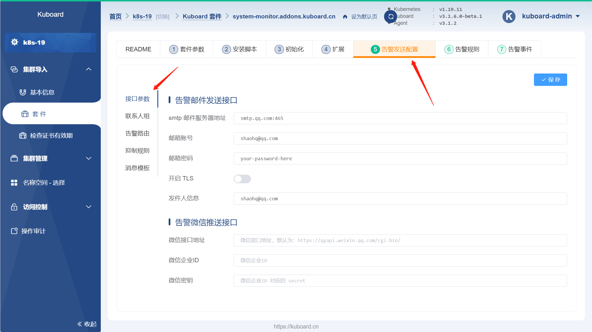
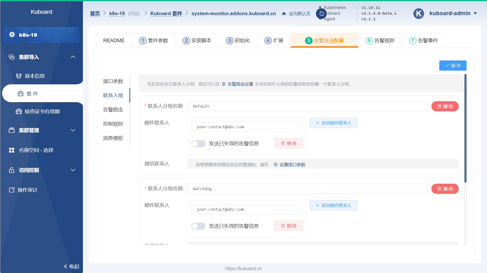
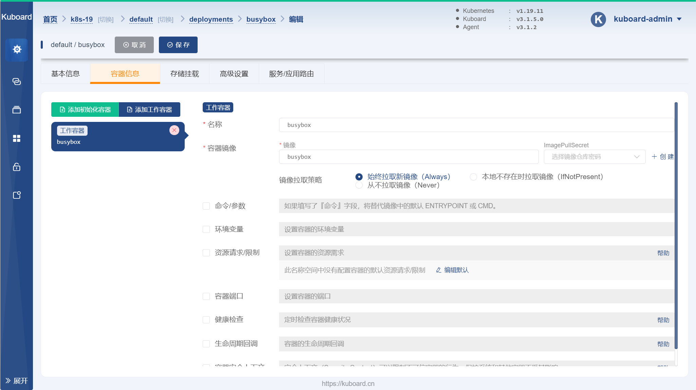
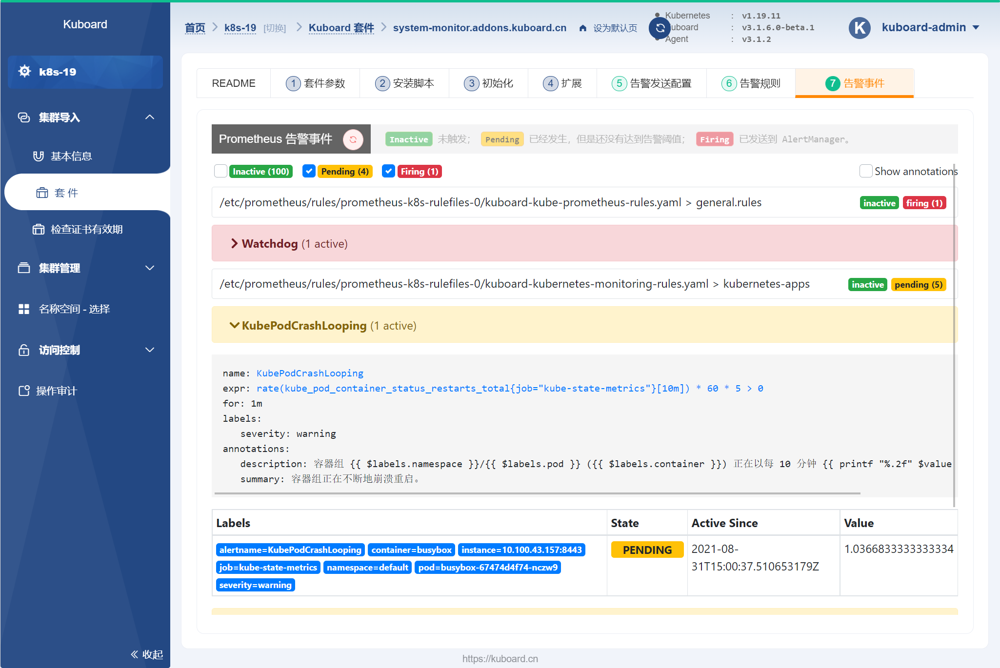
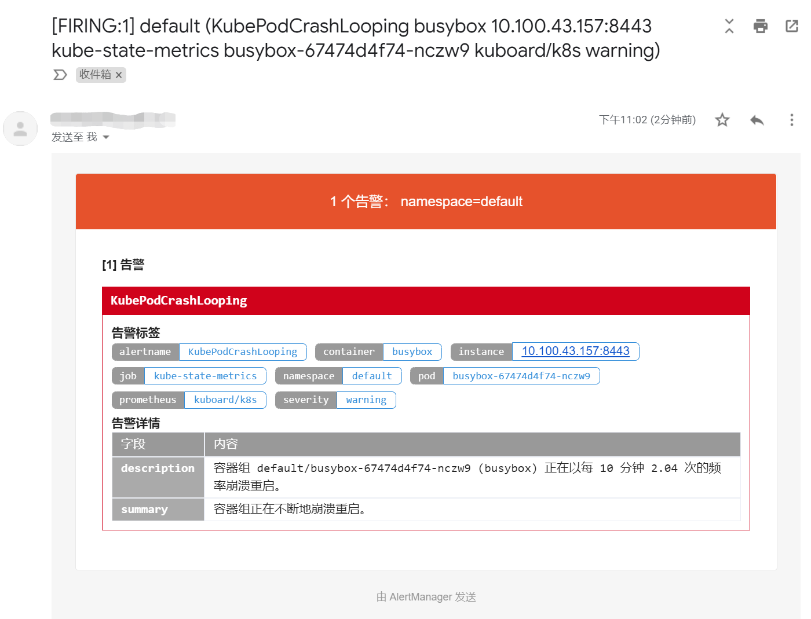

# 告警（邮件）

Kuboard 监控套件已经支持如下配置：
* 配置 Email、WeChat 作为消息发送渠道；
* 配置告警联系人；
* 配置告警路由；
* 配置告警抑制规则；
* 配置告警消息模板；
* 配置告警规则；

## 前提

使用 Kuboard 监控套件的告警功能前，假设您已经完成了 `Kuboard 资源层监控套件` 的安装，请参考 [监控](./monitor.html)

## 配置告警

本章节将简述如何配置 Kuboard 资源监控套件以发送告警消息。

* 导航到 `资源监控套件` 的安装页面
* 切换到 `告警发送配置` 标签页，并填写告警发送的接口参数，如下图所示：
  
  

* 切换到 `联系人组` 标签页，并填写接收告警信息的联系人邮件地址，如下图所示：

  > 默认有三个联系人组，建议每个联系人组至少配置一个联系人邮件地址。

  

* 点击 `保存` 按钮，保存您做的配置修改。

* 切换到 `告警规则` --> `kubernetes-monitoring` --> `kubernetes-apps` 的标签页，在该标签页修改告警名称 `KubePodCrashLooping` 的持续时间为 `1m` （代表 1 分钟），如下图所示：

  

* 模拟错误
  
  在任意名称空间创建一个 Deployment，将其中的容器 image 设置为 `busybox`，命令行参数为空。此时，busybox 将在启动后就立刻退出，我们就可以模拟出应用程序不断崩溃重启的现象。

  

* 查看告警事件

  切换到 `告警事件` 标签页，如下图所示：

  > 大约 1 分钟后，KubePodCrashLooping 的事件将从 `PENDING` 状态切换到 `FIRING` 状态，表明告警事件已发送到 AlertManager

  

* 查看告警邮件

  登录 Default 联系人组的联系人邮箱，可以查看该告警消息如下所示：

  > AlertManager 在收到告警事件后，大约需要等 1 分钟左右（取决于告警路由中的配置）才发送邮件给告警联系人。

  

至此，我们已经完成了告警功能的最基本配置。